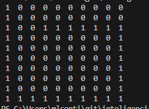
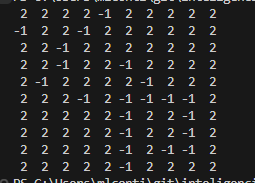
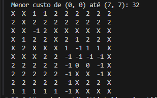
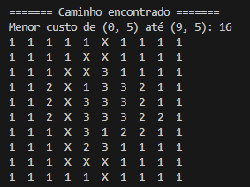
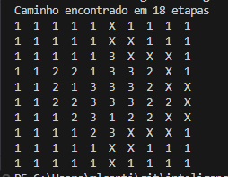

# Inteligência Articial 

Repositório da Disciplina de Inteligência Articial da FURB 2025/2

### Alunos
- Micael Luan Conti
- Maju Testoni

### Professor
Maiko Rafael Spiess (Doutorado em Política Científica e Tecnológica)

## Etapas

### Etapa 1
1. O ambiente foi representado por meio de uma **matriz**.  
2. Cada movimento do agente corresponde a **andar uma posição (valor = 1)**.  
3. Definiu-se a **preferência de direção**:  
   - 1º → Direita  
   - 2º → Baixo  
   - 3º → Esquerda  
   - 4º → Cima  
4. Sempre que o agente encontra uma parede, ele muda a direção.  
5. O processo termina quando o agente retorna à primeira posição da matriz.

#### Resultado:

### Etapa 2
Foi implementado um algoritmo inspirado em **Depth-First Search (DFS)**.  

#### Estados das posições:
- `0` → Não visitada  
- `1` → Encontrada  
- `2` → Totalmente visitada  

#### Funcionamento:
1. A posição atual do agente é marcada como **encontrada (1)**.  
2. Essa posição é adicionada à **lista de movimentos**.  
3. Verifica-se as direções possíveis.  
4. O agente se move para uma nova posição.  
5. Caso não haja movimentos possíveis, o agente **retrocede**.  
6. Ao retroceder, a célula é marcada como **totalmente visitada (2)**.  
7. O último movimento é removido da lista.  
8. O processo termina quando a lista de movimentos está vazia. 

#### Resultado:

### Etapa 3
Foi implementado um algoritmo inspirado em **Breadth-First Search (BFS)**.  

#### Estruturas utilizadas:
- Lista de **parentesco**  
- Lista de **distância**  
- **Fila** de posições  

#### Estados das posições:
- `0` → Não visitada  
- `1` → Encontrada  
- `2` → Totalmente visitada  

#### Passos:
1. A posição inicial é adicionada à **fila** e marcada como **encontrada (1)**.  
2. Sua distância é marcada como **0**.  
3. A cada iteração:  
   - Remove-se a posição `p` da fila.  
   - Para cada posição adjacente `a` de `p`:  
     1. `a` é adicionada à fila.  
     2. `a` é marcada como encontrada.  
     3. `p` é definido como **pai** de `a`.  
     4. A distância de `a` é `distância(p) + 1`.  
     5. Se `a` for o destino, o loop termina.  
   - `p` é marcada como **totalmente visitada (2)**.  

#### Resultado:

### Etapa 4
Foi considerado que o ambiente possui **tipos de terrenos com custos diferentes**:  
- Normal = `1`  
- Arenoso = `2`  
- Rochoso = `3`  

#### Implementação:
1. A matriz herdada dos agentes anteriores foi adaptada para atribuir **custos aos espaços**.  
2. O robô analisa seus vizinhos e **escolhe o vértice de menor custo**.  
3. O processo é repetido até a formação de uma **árvore de custo mínimo**.  

#### Resultado:

### Etapa 5

Nesta etapa, o foco foi a **geração do caminho final**.  

#### Antes do loop:
- As posições possuem valores de custo:  
  - Normal = `1`  
  - Arenoso = `2`  
  - Rochoso = `3`  

#### Durante o loop:
1. A posição `p` é adicionada ao caminho.  
2. Se `p` for o destino, o loop é encerrado.  
3. O valor de `p` é atualizado para `p + 1`.  
4. São obtidos os **vizinhos adjacentes**:  
   - Todos os adjacentes são listados.  
   - Eles são ordenados com base na direção do destino.  
5. O vizinho de **menor valor** é escolhido como a nova posição `p`.  

#### Resultado:

